# JobPortalAnalysis

We have a job portal dataset and have a task to perform data analytics using the dataset.

## Perform Basic Analysis

### Highligh Missing Values

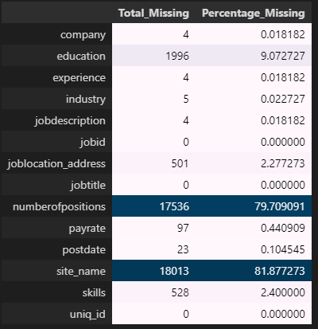

### Correlationship Between Features

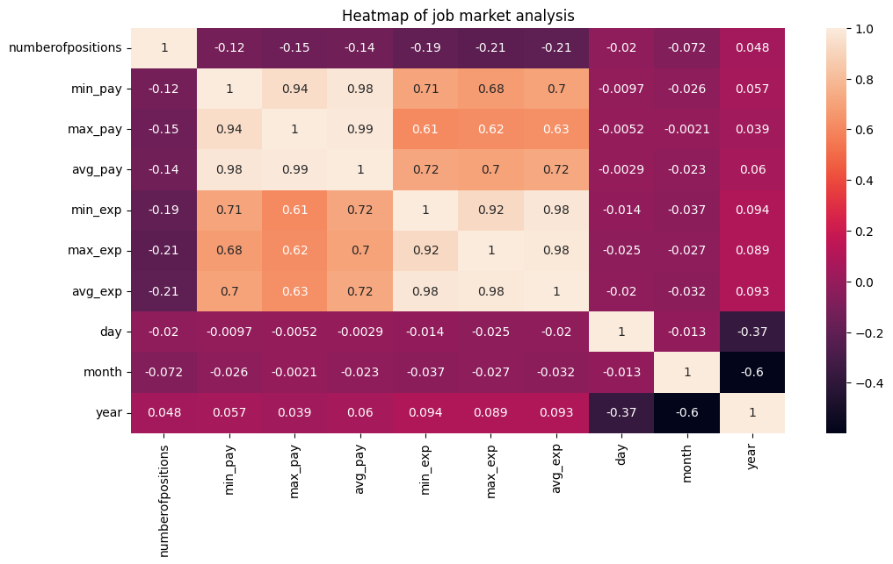

### List Top 10 companies with respect to job posting

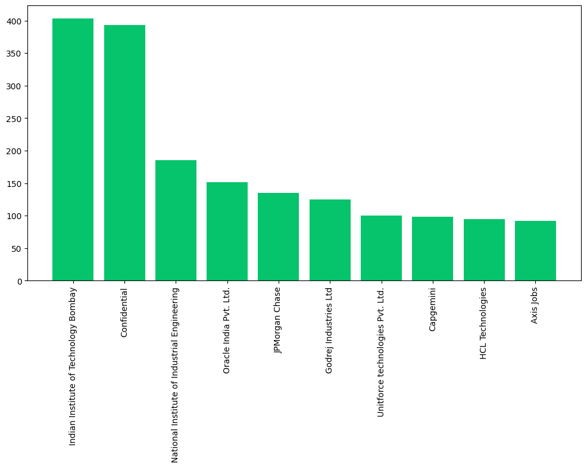

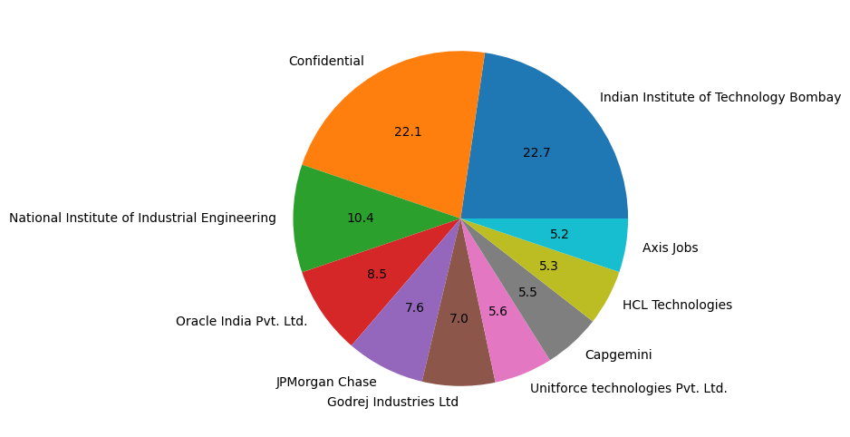

### Top 10 Industry by Jobs Posting

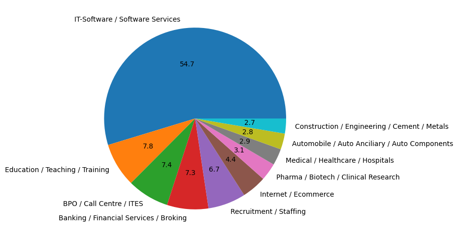

### Top 10 Job Titles by Jobs Posting

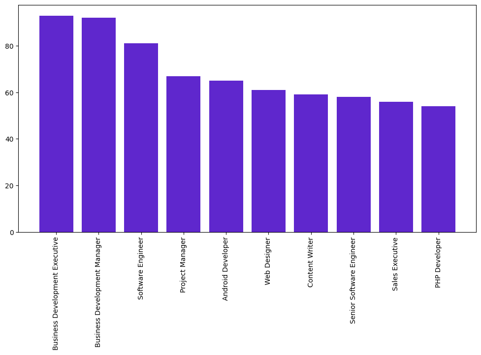

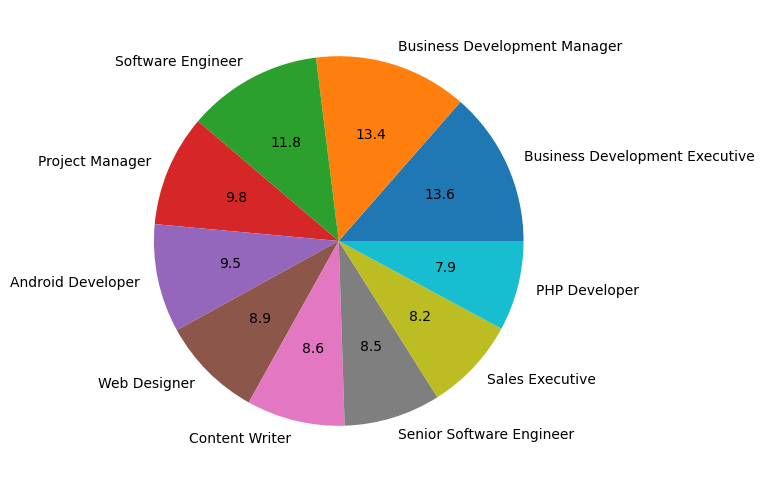

### Top 10 Skills by Jobs Posting

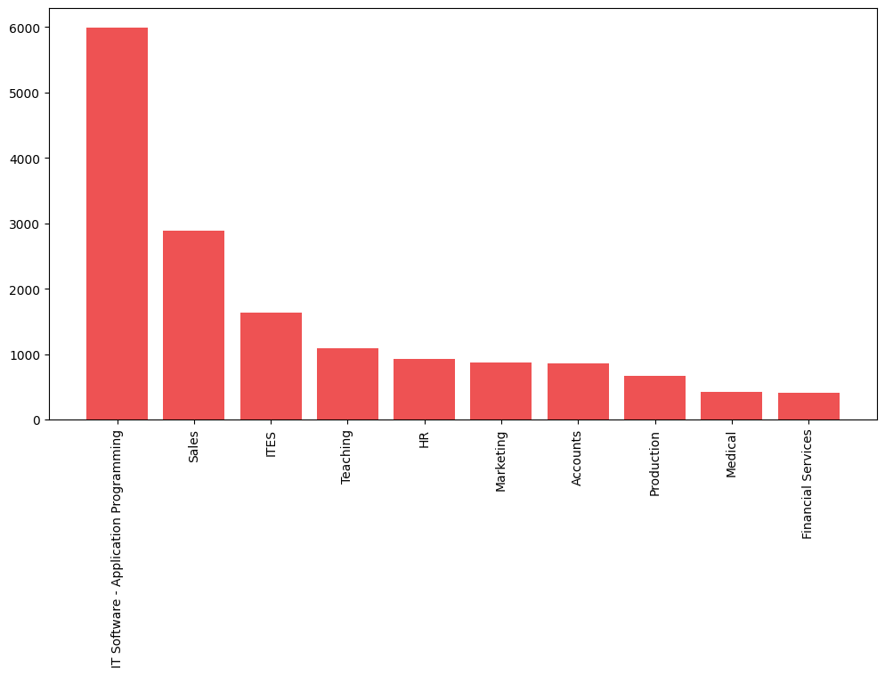

### Top 10 Locatons by Jobs Posting

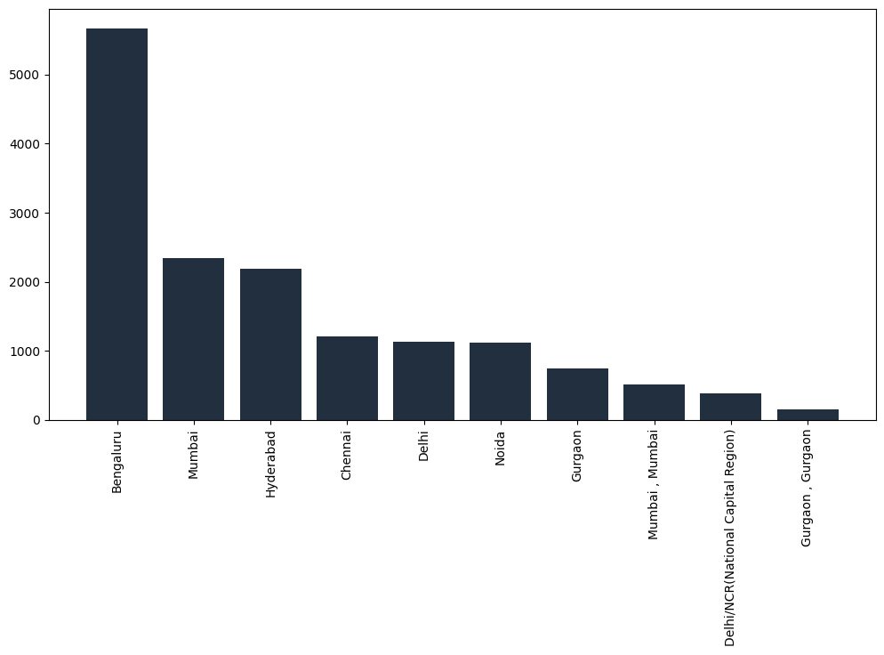

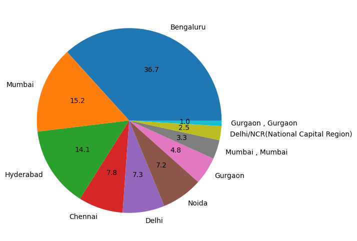

### Display relationship between Min Pay and Min Exp

### Display relationship between Max Pay and Max Exp

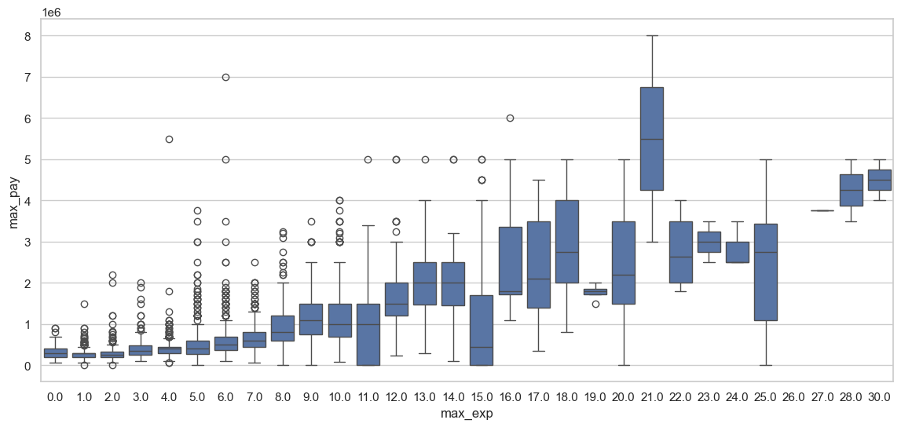

### Top 10 Maximum Payrate based on Industry

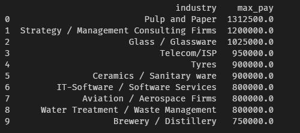

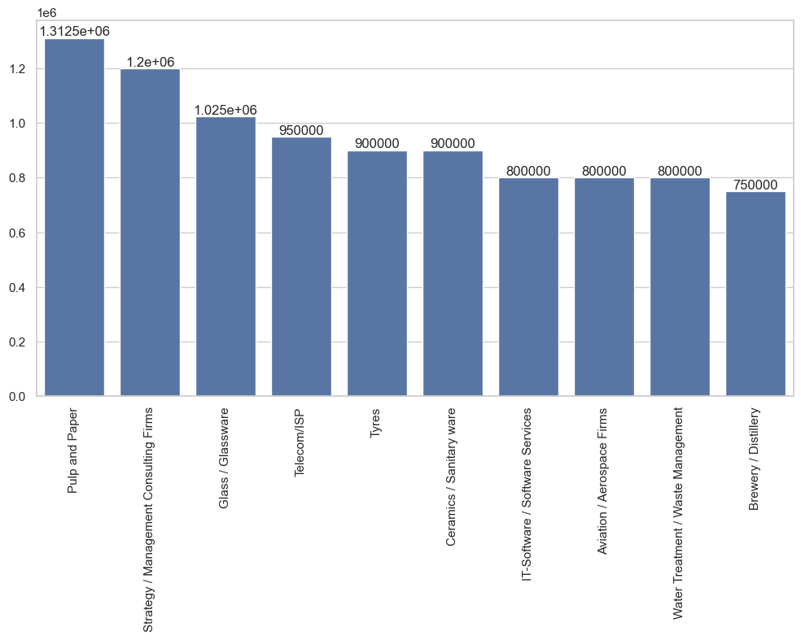

### Industry wise top 10 number of positions

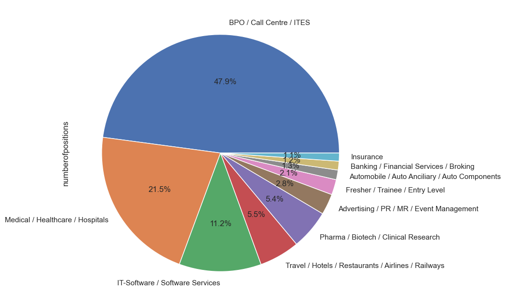

